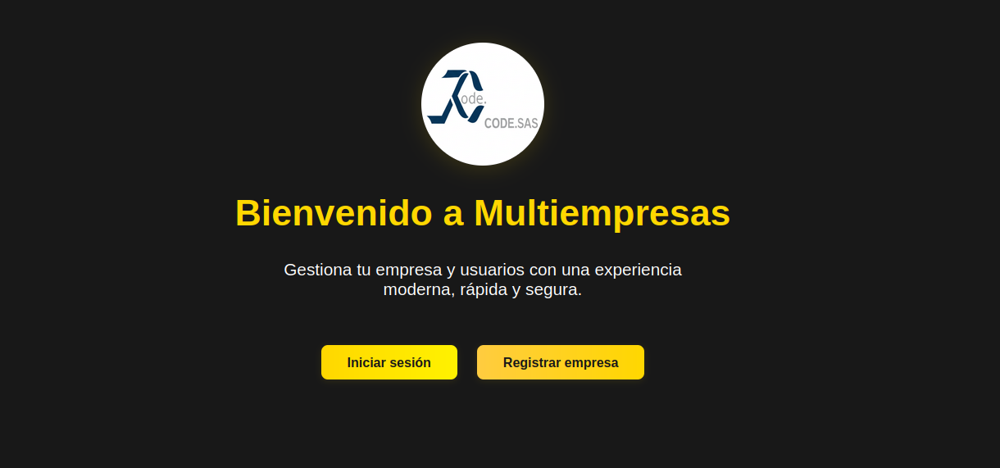

# Sistema de Gestión Multiempresas

## 📋 Descripción
Sistema web full-stack para la gestión de múltiples empresas con sistema de suscripciones. Permite a las empresas gestionar usuarios, monitorear actividades y administrar sus suscripciones de manera eficiente.


## ✨ Características Principales

### Gestión de Empresas
- Registro de nuevas empresas
- Panel de administración personalizado
- Gestión de suscripciones
- Monitoreo de actividades y estadísticas

### Gestión de Usuarios
- Sistema multinivel de usuarios
- Administradores por empresa
- Control de accesos y permisos
- Gestión de perfiles de usuario

### Sistema de Suscripciones
- Planes diferenciados (Básico, Profesional, Empresarial)
- Activación/desactivación de suscripciones
- Estado de suscripción en tiempo real
- Proceso de pago integrado

### Dashboard Analítico
- Estadísticas en tiempo real
- Gráficos de actividad
- Historial de acciones
- Notificaciones y actualizaciones

## 🛠 Tecnologías Utilizadas

### Frontend
- React.js
- React Router para navegación
- CSS modular para estilos
- JWT para autenticación

### Backend
- Django
- Django REST Framework
- JWT Authentication
- SQLite3/MySQL para base de datos

### 🌳 Estructura del Proyecto

- **📂 my-full-stack-multiempresas/**
  - **📂 backend-multiempresas/** # Código del backend (Django)
    - 📁 empresas/ # App principal de Django
    - 📁 multiempresa2/ # Configuración principal del proyecto
    - 📄 manage.py # Herramienta de línea de comandos de Django
    - 📝 requirements.txt # Dependencias de Python
  - **📂 frontend-multiempresas/** # Código del frontend (React)
    - 📁 public/ # Archivos públicos y estáticos
    - 📁 src/ # Archivos fuente de React
      - 📁 components/ # Componentes reutilizables
      - 📁 pages/ # Vistas y páginas de la aplicación
      - 📁 api/ # Servicios para las peticiones a la API
      - 📁 utils/ # Funciones de utilidad
    - 📝 package.json # Dependencias y scripts de Node.js
  - 📝 .gitignore # Ignora archivos y carpetas en Git
  - 📜 LICENSE # Archivo de licencia
  - 📄 README.md # Este archivo

#  ✅ Requisitos Previos

## Software Necesario
- Python 3.8+ (Recomendado usar la última versión estable)
- Node.js 14+ (Recomendado usar la última versión LTS)
- npm (viene con Node.js) o Yarn
- Git
- MySQL (Necesitarás un servidor de base de datos)
  - Opciones recomendadas: XAMPP, LAMP, MAMP o Docker

## Verificación de Versiones
Puedes verificar que todo esté instalado correctamente usando estos comandos:
```bash
python --version    # Debe mostrar 3.8 o superior
node --version     # Debe mostrar 14.0 o superior
npm --version      # Versión compatible con tu Node.js
yarn --version     # Opcional, alternativa a npm
git --version      # Cualquier versión reciente
mysql --version    # Versión 5.7 o superior recomendada
```


#  ⚙️ Configuración e Instalación

## Obtención del Código

### Opción 1: Fork y Clonación (Recomendado)
1. Haz fork del repositorio en GitHub (botón Fork en la esquina superior derecha)
2. Clona tu fork:
```bash
git clone https://github.com/TU-USUARIO/my-full-stack-multiempresas.git
cd my-full-stack-multiempresas
```

### Opción 2: Clonación Directa
```bash
git clone <URL_DEL_REPOSITORIO>
cd my-full-stack-multiempresas
```

## 🗄️ Configuración del Backend (Django)

### Navega a la carpeta del backend
cd backend-multiempresas

### Crea un entorno virtual (si no existe)
python3 -m venv venv

### Activa el entorno virtual
#### En Linux/macOS:
source venv/bin/activate
#### En Windows (Command Prompt):
.\venv\Scripts\activate
#### En Windows (PowerShell):
.\venv\Scripts\Activate.ps1

### Instala las dependencias de Python
#### Si encuentras el error "externally-managed-environment", usa:
./venv/bin/pip install -r requirements.txt
#### De lo contrario, puedes usar:
pip install -r requirements.txt

##  📂 Configura la base de datos

#### Asegúrate de tener MySQL instalado y configurado.
#### puedes usar un cliente MySQL como XAMPP, LAMP, MAMP o Docker para crear la base de datos. o ejecutar comandos SQL directamente.
#### Crea una base de datos llamada 'multiempresas' (o el nombre que prefieras). 
#### Configura la conexión a la base de datos en backend-multiempresas/multiempresa2/settings.py
#### Busca la sección DATABASES y actualiza con tus credenciales de MySQL:

DATABASES = {
    'default': {
        'ENGINE': 'django.db.backends.mysql',
        'NAME': 'multiempresas',
        'USER': 'root',
        'PASSWORD': '',
        'HOST': 'localhost',
        'PORT': '3306',
    }
}


#### Aplica las migraciones de la base de datos
python manage.py migrate

#### Verifiva en el xampp o similar que la base de datos multiempresas se haya creado correctamente.

#### (Opcional) Crea un superusuario para acceder al panel de administración de Django
python manage.py createsuperuser

#### Vuelve a la carpeta raíz del proyecto
deactivate # Desactiva el entorno virtual del backend
cd ..

## 🖥️ Configuración del Frontend (React)
Navega a la carpeta del frontend e instala las dependencias de Node.js.# Navega a la carpeta del frontend
cd frontend

#### Instala las dependencias de Node.js
npm install
#### o si usas Yarn:
yarn install

#### Vuelve a la carpeta raíz del proyecto
cd ..

##  🚀 Cómo Ejecutar el Proyecto 🚀
Necesitarás ejecutar el servidor de Django (backend) y el servidor de desarrollo de React (frontend) por separado. Es recomendable usar dos terminales.

1. Iniciar el Backend 🗄️
   
- Abre una nueva terminal
cd backend-multiempresas/

- Crea un entorno virtual (si no existe)
python3 -m venv venv

- Activa el entorno virtual
source venv/bin/activate

- Inicia el servidor de Django
python manage.py runserver

El servidor de Django se ejecutará por defecto en [http://127.0.0.1:8000/]

2. Iniciar el Frontend 🖥️
   Abre una segunda terminal, navega a la carpeta frontend/ e inicia la aplicación de React.
   
- Abre una segunda terminal
cd frontend-multiempresas

- Inicia la aplicación de React
npm run start
  
- si usas Yarn
yarn start


La aplicación de React se abrirá por defecto en tu navegador en http://localhost:3000/ (o el puerto configurado por Create React App/Vite).

# Scripts Útiles
## Backend (desde la carpeta backend/ con el entorno virtual activado)
- python manage.py runserver: Inicia el servidor de desarrollo de Django.
- python manage.py migrate: Aplica las migraciones de la base de datos.
- python manage.py makemigrations <nombre_app>: Crea nuevas migraciones para una aplicación específica.
- python manage.py createsuperuser: Crea un superusuario.
- pip freeze > requirements.txt: Actualiza el archivo de dependencias de Python.
## Frontend (desde la carpeta frontend/)
- npm start o yarn start: Inicia el servidor de desarrollo de React.
- npm build o yarn build: Compila la aplicación de React para producción.
- npm test o yarn test: Ejecuta los tests del frontend.

# 🙋 Contribución  🤝 🌟
Si deseas contribuir a este proyecto, por favor, sigue estos pasos:
1. Haz un fork del repositorio.
2. Crea una nueva rama (git checkout -b feature/nueva-funcionalidad).
3. Realiza tus cambios y commitea (git commit -m 'feat: añade nueva funcionalidad').
4. Push a tu fork (git push origin feature/nueva-funcionalidad).
5. Abre un Pull Request describiendo tus cambios.

# 📜 Licencia

Este proyecto está bajo una licencia MIT modificada con restricciones comerciales. Esto significa que puedes:

✅ Clonar y hacer fork del repositorio
✅ Modificar y estudiar el código
✅ Usar el proyecto para fines educativos y no comerciales
✅ Contribuir con mejoras mediante pull requests

Sin embargo, requieres permiso explícito de JC Code SAS para:
⚠️ Uso comercial del software
⚠️ Venta o distribución del software
⚠️ Ofrecer el software como servicio (SaaS)

Para más detalles, consulta el archivo [LICENSE](LICENSE).

### Contacto
Para consultas comerciales o permisos, contacta a:
📧 lider@jcsoftware.com.co

---
© 2025 JC Code SAS. Proyecto bajo licencia MIT con restricciones comerciales.
